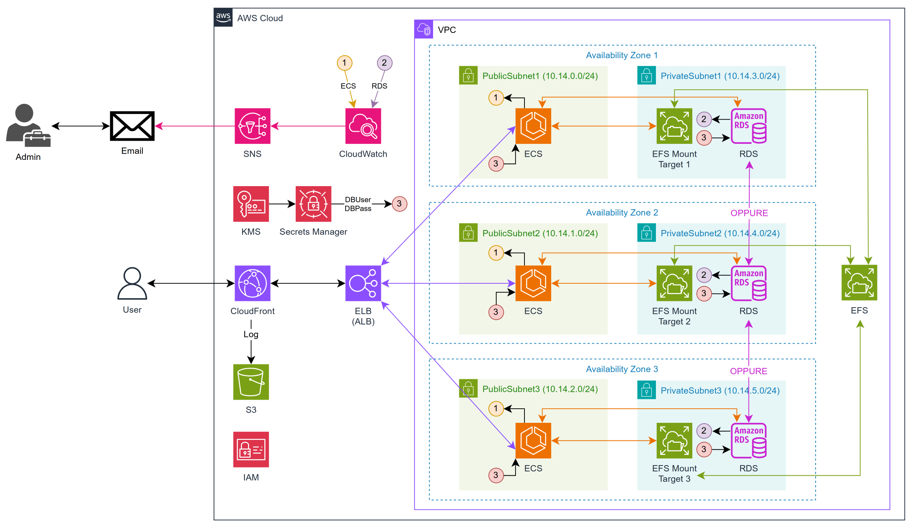

# Wordpress deployment on AWS

This project creates a secure, resilient, scalable, replicable, distributed Wordpress deployment.

The following technologies are used:
- AWS CloudFormation (stack deployment)
- AWS CloudFront
- AWS CloudWatch
- AWS ECS
- AWS EFS
- AWS ELB
- AWS IAM
- AWS KMS
- AWS RDS
- AWS S3
- AWS SNS
- AWS Secrets Manager
- AWS VPC



## Structure
This project is structured as follows:
```
├── Makefile
├── templates
│   └── *.yaml
├── wordpress-dev.json
└── wordpress-prod.json
```

The `templates` folder contains the following:

```
├── alb.yaml
├── cloudfront.yaml
├── cloudwatch.yaml
├── ecs.yaml
├── efs.yaml
├── env.yaml
├── kms.yaml
├── network.yaml
├── rds.yaml
├── s3.yaml
├── secrets-manager.yaml
└── sns.yaml
```

Each file creates a piece of infrastructure.

In order to deploy this stack, `rain merge` is used to create one singular file.

## Prerequisites
In order to deploy this stack & work with it, the following tools are required:
- [rain](https://github.com/aws-cloudformation/rain)
- [jq](https://github.com/jqlang/jq)

## Makefile overrides
The `rain` binary in `Makefile` is called from `RAIN_CMD`, which defaults to `$HOME/go/bin/rain`.
Change this parameter if your path is different!

Example:

```bash
RAIN_CMD=/usr/local/bin/rain make deploy
```

Similarly, the following Makefile variables can be overridden:

- `STACK_NAME`: the name of the stack (default: `WordpressStack`)
- `RAIN_CMD`: path to `rain` (default: `${HOME}/go/bin/rain`)
- `PARAMS_FILE`: path to the development parameters (default: `wordpress-dev.json`)
- `PARAMS_FILE_PROD`: path to the production parameters (default: `wordpress-prod.json`)

## Deploying the stack
Deploying the CloudFormation stack is real easy.

The provided `Makefile` provides the following commands:
- `make lint`: lint the merged CloudFormation template
- `make deploy`: deploy the CloudFormation stack using rain (development values)
- `make deploy-prod`: deploy the CloudFormation stack using rain (production values)
- `make delete`: delete the deployed CloudFormation stack using the AWS CLI
- `make clean`: remove the merged CloudFormation template

Running `make deploy` is an easy, hassle-free way to get started with this stack.

**NOTE**: please set the `AdminEmail` parameter before deploying.
More info below.

### Outputs
The following outputs are produced:
- `CFDomainName`: the CloudFront distribution's publicly-accessible DNS Name. This is the Wordpress deployment's URL.

## Technical design notes
### Admin Email
This stack provides the following CloudWatch Alerts:
- ECS: CPUUtilization average >= 70% for 5 minutes
- RDS: CPUUtilization average >= 70% for 5 minutes

The thresholds (70%) can be changed independently of each other.

Alerts are then relayed to an SNS Topic, which is configured to send
email to the provided `AdminEmail` parameter through an SNS Subscription.

**Don't forget to set this value!** The default is `CHANGEME@example.com`.

### CloudFront <-> ALB
The ALB only accepts direct traffic from CloudFront, by providing
a [custom header](https://docs.aws.amazon.com/AmazonCloudFront/latest/DeveloperGuide/restrict-access-to-load-balancer.html).

This header is named `X-Origin-CloudFront-Only`, and its value is generated automatically
when running `make deploy` (or `make deploy-prod`) with the following command:

```bash
openssl rand -base64 32
```

NOTE: the ALB also enables stickiness, provided by a LB cookie,
for a total duration of 15 minutes. This value can be changed.

Stickiness needs to be turned on in order to allow logins.
Without it, trying to login would result in a page refresh.

### RDS DB Credentials
The credentials used to access the RDS DB (username & password) are generated
automatically (and therefore, stored) by Secrets Manager.

Constraints:
- Username: 16 characters max, no numbers, no punctuation, no uppercase chars, no spaces
- Password: default 32 characters, no spaces, `"@/\` characters excluded

These are then referenced by both RDS and ECS.

Secrets are encrypted using a KMS Key generated by this stack.
The default key encryption used is `AES-128-GCM`.

### RDS Deployment
When `EnvType` is set to `prod` (production), the RDS DB is deployed
with `MultiAZ = true`. Otherwise, the DB is deployed in a single AZ.

**NOTE**: a MultiAZ deployment does not deploy the DB in all three AZs.
Instead, it creates a master instance in a random AZ, and a
secondary/slave instance in another random AZ, totaling two AZs.

The RDS Storage is encrypted with another KMS Key generated by this stack.

**NOTE**: that the provided storage type is `gp2`, which is the one
provided in the free tier. Change this value accordingly.

### VPC
The CIDR of the VPC is (obviously) a parameter. The value in the provided parameter files
is set to `10.14.0.0/16`.

Subsequently, the subnets' CIDRs (both public & private) are not hardcoded,
meaning their values are automatically calculated from the VPC CIDR value,
by using the following formula:

```yaml
!Select [n, !Cidr [ !Ref VPCCIDR, c, 8 ]]
```

Where:
- `n`: generated CIDR number (from 0 to 5; the first 3 are used for the public subnets)
- `c`: how many subnets to create (6)
- `8`: subnet bits (`32 - 24 = 8`); a `/24` address space is assigned for each subnet

### Wordpress version
The wordpress version is parametrized, meaning the `WordpressVersion` parameter
can be used to set a specific version. The recommended default is `latest`.

You can see available versions [here](https://hub.docker.com/_/wordpress).
